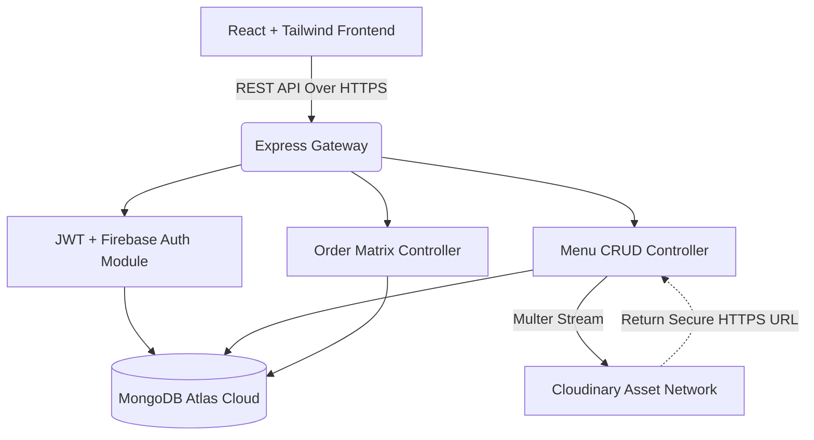

<div align="center">


# 🍽️ Owen Express
**The Premium Full-Stack Food Delivery Ecosystem**

[](https://github.com/vipulpatial82/Owen-express)
[](https://owen-express-food.vercel.app)
[](https://owen-express-backend.onrender.com)
[](LICENSE)

<br/>


<br/>

**Owen Express** is a  production-grade MERN stack restaurant management and food delivery application. Engineered from the ground up for maximum performance and visual excellence, it bridges the gap between hungry customers and efficient kitchen management through a stunning glassmorphic interface and a lightning-fast Node.js backend.

</div>

---

## 📖 Table of Contents
- [✨ Core Features](#-core-features)
- [☁️ Cloud Integrations (Firebase & Cloudinary)](#️-cloud-integrations-firebase--cloudinary)
- [🏗️ System Architecture](#️-system-architecture)
- [💻 User Interfaces](#-user-interfaces)
  - [Customer Portal](#customer-portal)
  - [Admin Command Center](#admin-command-center)
- [🛠️ Tech Stack & Dependencies](#️-tech-stack--dependencies)
- [⚙️ Local Development Setup](#️-local-development-setup)
- [🚀 Deployment Strategy](#-deployment-strategy)
- [🔒 Security Constraints](#-security-constraints)

---

## ✨ Core Features

* **Premium Visual Identity:** Crafted with advanced glassmorphism, subtle neumorphic shadows, dynamic micro-animations, and 3D flip-card menu displays.
* **Intelligent Cart System:** Persistent, state-managed shopping cart localized to the user's browser, preventing accidental un-checkouts.
* **Multi-Gateway Payments:** Supports arbitrary checkout modes including Cash on Delivery, UPI, and Credit Cards.
* **Real-Time Order Funnel:** Highly accurate timeline generation where administrators lock-in actual prep and delivery ETA's dynamically upon order acceptance.
* **Role-Based Authorization System:** Rigid architectural separation between end-users and administrators. Admin logic strips all non-managerial bloat (like personal carts and track-order interfaces) to enforce a pure workspace.

---

## ☁️ Cloud Integrations (Firebase & Cloudinary)

This platform relies on industry-standard cloud partners to outsource critical infrastructure, ensuring infinite scalability and zero-downtime operations.

### 🔥 Firebase (Google OAuth & Identity)
Instead of forcing users to remember a new set of credentials, Owen Express utilizes **Firebase Authentication** natively. 
- Integrated single-click **Google Sign-In**.
- Seamlessly intercepts Firebase SDK tokens, hands them to the initial Express backend, and registers/signs-in users instantly while simultaneously creating a local MongoDB session backed by JSON Web Tokens (JWT).
- Highly secure identity federation ensuring user emails remain untouched and verifiable.

### 🖼️ Cloudinary (Asset Delivery Network)
Handling static image assets locally on a basic server leads to massive performance bottlenecks. Owen Express completely offloads this using **Cloudinary**:
- **Real-time Image Uploads:** When an Admin adds a new high-res food image, the Node.js backend intercepts the `multipart/form-data` using **Multer**.
- **multer-storage-cloudinary:** Automatically pipelines the payload straight to a Cloudinary CDN cluster.
- **Instant Delivery:** The database simply saves the optimized `.webp / .jpg` secure URL, which serves images globally at edge-speeds, ensuring the UI remains optimized regardless of menu size.

---

## 🏗️ System Architecture



---

## 💻 User Interfaces

### Customer Portal
A visually captivating space designed to maximize conversions and user engagement.
- **Dynamic Exploration:** Users can toggle purely vegetarian menus, search live databases, and flip individual cards backward to read high-level ingredient configurations.
- **Order Tracking:** A graphical timeline denoting "Pending," "Preparing," "Out for Delivery," and "Delivered" states, all updating natively based on Admin inputs.
- **Feedback Loop:** Built-in review and rating aggregator for completed orders.

### Admin Command Center
A dark-mode, highly specialized workspace completely isolated from regular user logic.
- **Live Inventory Dashboard:** Absolute control. Add, edit, swap images (via Cloudinary), or toggle item statuses (e.g., "Chef's Special", "Veg" categorization) on the fly.
- **Kanban Order Management:** Visual columns showcasing inbound orders. Admins can natively hit "Accept" and instantly input *Custom Prep Times* or hit "Reject" to cancel.
- **Real-Time Analytics:** Clean widget panels displaying total item arrays and ratio breakdowns (Veg vs Non-Veg). 

---

## 🛠️ Tech Stack & Dependencies

| Tier | Technology Suite | Implementation Value |
|---|---|---|
| **Frontend UI** | React.js 18 + Vite | State hydration & lightning-fast component rendering |
| **Styling** | Vanilla Tailwind CSS | Utility-driven, zero-bloat, responsive glassmorphism |
| **Authentication** | Firebase SDK + Bcryptjs | Google OAuth integration alongside 10-round salted password hashing |
| **Backend Runtime** | Node.js + Express 5 | High-throughput asynchronous API handling |
| **Database** | MongoDB + Mongoose | flexible document structuring for nested order schemas |
| **Cloud Storage** | Cloudinary + Multer | Highly optimized, geographically distributed image caching |
| **Session Tracking** | JSON Web Tokens (JWT) | Stateless REST-compliant user session enforcement |

---

## ⚙️ Local Development Setup

Wanna run this locally? Follow these steps exactly.

### Prerequisites
- Node.js (v16+)
- A MongoDB cluster or local instance (`mongodb://127.0.0.1:27017`)
- Firebase Account (Web App Credentials)
- Cloudinary Account (API Keys)

### 1. Clone the Ecosystem
```bash
git clone https://github.com/vipulpatial82/Owen-express.git
cd Owen-express
```

### 2. Ignite the Backend (Node/Express)
```bash
cd backend
npm install
```

Craft a `.env` payload in the `/backend` root:
```env
MONGO_URI=mongodb+srv://<user>:<password>@cluster...
JWT_SECRET=your_hyper_secure_jwt_secret_phrase
PORT=5000

# Cloudinary Edge CDN Keys
CLOUDINARY_CLOUD_NAME=your_cloud_identity
CLOUDINARY_API_KEY=your_issued_api_key
CLOUDINARY_API_SECRET=your_issued_api_secret
```
Run the server:
```bash
npm run dev
```

### 3. Ignite the Frontend (React/Vite)
Open a new terminal instance:
```bash
cd frontend
npm install
```

Craft a `.env` payload in the `/frontend` root for Firebase routing:
```env
VITE_API_URL=http://localhost:5000
VITE_FIREBASE_API_KEY=your_firebase_key
VITE_FIREBASE_AUTH_DOMAIN=your_project.firebaseapp.com
VITE_FIREBASE_PROJECT_ID=your_project_id
```

Spin up the Vite compiler:
```bash
npm run dev
```
Navigate to `http://localhost:5173`.

---

## 🚀 Deployment Strategy

Owen Express natively supports rapid deployment architecture.

- **Vercel (Frontend Segment):** Connect your GitHub repository to Vercel. Set the *Framework Preset* to Vite. Map the `VITE_API_URL` to your production backend URL. Everything else routes automatically out of the `/frontend` directory via `npm run build`.
- **Render (Backend Segment):** Hook the `/backend` directory up as a Node Web Service. Populate every `.env` mapping in the Render dashboard. Ensure MongoDB network access explicitly whitelists Render's outward IPs (or universally fallback to `0.0.0.0/0`).

---

## 🔒 Security Constraints

This platform does not cut corners on access mitigation.
1. **Password Hashing:** `bcryptjs` guarantees no raw passwords hit the MongoDB cluster.
2. **Stateless Delivery:** The UI never holds auth context natively in source code. LocalStorage secures JWT payloads which are interrogated instantly via Bearer headers on every REST request.
3. **Admin Middleware:** Protected backend routes explicitly check if `req.user.isAdmin === true`. Standard users literally cannot create menu items or invoke Cloudinary Multer routes, even if they artificially falsify API endpoint payloads.
4. **Environment Isolation:** Zero static secrets live in the codebase. All connection strings operate entirely via `.env` injection.

---

<div align="center">
  
**Developed by Vipul Patial**  
[GitHub Profile](https://github.com/vipulpatial82) • [Repository Base](https://github.com/vipulpatial82/Owen-express)

*If this code saves you hours of development time, please consider leaving a ⭐ on the repository!*

</div>
